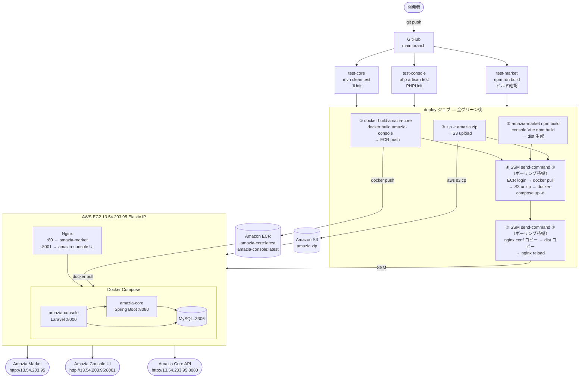

# Amazia

## プロジェクト概要

Amazia は、商品管理・在庫管理・ECフロントを一体化した「個人開発としては異例の業務レベルのEC基盤」です。

- 3システム構成（Market / Console / Core）
- React / Vue / Java / PHP の複数技術スタック
- AWS（EC2 / ECR / S3 / SSM）を用いた本番運用
- CI/CDパイプラインを自前構築
- 設計・実装・デプロイ・運用までを2人で完遂(1人はClaude Code)

実務で得た知見を再構成し、
“業務レベルのシステムを1人で作り切る力”を証明するためのプロジェクトです。

---

## このプロジェクトで得た成果

### 設計力 — 実務パターンの再構成と完走
業務システムで扱ってきた在庫・注文・マスタ管理などの構成を棚卸しし、**3 システム構成・複数言語・複数 DB という業務レベル相当の複雑さ**にあえて引き上げた上で、設計から実装・デプロイまでを一貫して完走することを目指しています。

「設計書を書ける」ことと「設計書通りに動くシステムを最後まで作りきれる」ことの間にある距離を、自分の手で埋めることを成果と位置づけています。

### インフラ運用力 — 手を動かして得た障害対応経験
EC2・ECR・S3・SSM を使った CI/CD パイプラインを自前で構築し、その過程で **孤児コンテナ・SSM ポーリングのタイムアウトなど、ドキュメントを読むだけでは到達できない障害**に直接対処しています。

サーバーサイドエンジニアにとって、体系化された知識より「実際にハマって解決した経験」の方が現場で効くという考えのもと、トラブルは積極的に踏み抜き、原因・再発防止策を [docs/troubles/](docs/troubles/) に記録・蓄積しています。

### AI 協働開発の実践
Claude Code を中核に据えた AI 支援開発で進行しています。[CLAUDE.md](CLAUDE.md) および [docs/ai_context/test_insights.md](docs/ai_context/test_insights.md) に、AI へ渡すコンテキスト設計のノウハウや、過去のトラブルから抽出したテスト観点を蓄積しており、設計判断・テスト戦略・障害分析の各場面で AI を協働者として活用しています。

---

## このプロジェクトの位置づけ

Amazia は、**実践的なアーキテクチャ設計・CI/CD・AWS 運用、そして AI 協働開発の知見を、自分の手で動かしながら深めること**を目的としたプロジェクトです。

学習・検証・改善を繰り返しながら成長していくプロジェクトとして設計されており、新しい知見が得られるたびに設計・実装・ドキュメントへ反映していきます。

---

## アーキテクチャ図


---

## システム全体像

### 会員向けサイト
会員向けフロント
- 名前：Amazia Market
- 言語：React

### 管理画面
管理者が商品・会員・注文を操作
- 名前：Amazia Console
- 言語：PHP

### コアシステム
在庫・物流・バッチ処理
- 名前：Amazia Core
- 言語：Java

---

## 言語選定について

### フロント（React）と管理画面（PHP）を分けた理由
フロントと管理画面は仕様変更が頻繁に発生する領域なので、変更に強い React をフロントに採用。

一方で管理画面はフォーム中心で、サーバーサイドレンダリングの PHP の方が実装・保守が軽い。

さらに、学習目的でフロントとバックを異なる技術で構築することで、技術選定の幅を広げる狙いもある。

> ※本来は React か PHP のどちらかに統一した方が、採用コスト・保守コストは下がる。
> 今回は「学習と技術理解のためにあえて分けている」。

### 在庫管理・バッチ処理を Java にした理由
在庫管理やバッチ処理は "スピードよりも確実性・堅牢性" が求められる領域。
Java は型安全性・エコシステム・実行速度・信頼性の面で非常に強く、長期運用に向いた技術。
さらに、Java エンジニアは市場に多く、採用しやすいという現実的なメリットもある。

---

## ドキュメントマップ

```
docs/
├── setup.md                  # 環境構築手順（ローカル開発環境）
├── coding_guidelines.md      # コーディング規約（全システム共通）
├── architecture.svg          # システムアーキテクチャ図（全体構成）
├── cicd_pipeline.svg         # CI/CDパイプライン アーキテクチャ図
├── analysis/                 # 分析レポート・障害分析まとめ
├── api_design/               # システム別API定義（Console / Market / Core）
├── database_design/          # DB設計（ER図・テーブル定義）
├── design/                   # 設計・フェーズ別実装計画
├── sample_excels/            # 一括取り込み用サンプルExcel（商品登録 / SKU在庫入荷）
└── troubles/                 # 不具合記録・再発防止アクション
```

> 画面遷移図、リポジトリ構成を作成予定

---

## セットアップ手順

環境構築の詳細手順は [docs/setup.md](docs/setup.md) を参照。

### クイックスタート

```bash
# 起動
docker compose -f docker-compose.local.yml up --build

# 停止
docker compose -f docker-compose.local.yml down
```

| サービス | URL |
|---|---|
| Amazia Market（React） | http://localhost:5173 |
| Amazia Console UI（Vue） | http://localhost:5174 |
| Amazia Console API（Laravel） | http://localhost:8000 |
| Amazia Core API（Spring Boot） | http://localhost:8080 |

---

## 環境変数について
** 工事中 ** 

---

## DB設計

テーブル定義書・ER図は [docs/database_design/README.md](docs/database_design/README.md) を参照。

---

## API定義

システム別のAPI定義は [docs/api_design/](docs/api_design/) を参照。

| システム | ファイル |
|----------|---------|
| Console | [docs/api_design/Console_API.md](docs/api_design/Console_API.md) |
| Market | [docs/api_design/Market_API.md](docs/api_design/Market_API.md) |
| Core | [docs/api_design/Core_API.md](docs/api_design/Core_API.md) |

---

## UIテンプレート方針

| システム | フレームワーク | UIライブラリ | 理由 |
|---|---|---|---|
| Amazia Market | React | Material UI (MUI) | ECサイト向けコンポーネントが豊富 |
| Amazia Console | Vue.js | Ant Design Vue | 管理画面・フォーム系に強い。ReactとVue両方を学ぶ狙いもある |

> UIはフェーズ4以降に整える。フェーズ1〜3はテンプレートを当てはめるだけにして、バックエンドのTDDに集中する。

---

## CI/CD パイプライン


---

## 実装計画

| フェーズ | タイトル | ステータス | 詳細 |
|---------|---------|-----------|------|
| Phase 1 | 会員画面の実装 | ✅ 完了 | [phase1_5.md](docs/design/phase1_5.md#フェーズ1会員画面の実装) |
| Phase 2 | 管理画面から商品登録 | ✅ 完了 | [phase1_5.md](docs/design/phase1_5.md#フェーズ2管理画面から商品登録) |
| Phase 3 | Amaziaの骨格実装（フェーズ1＋2の統合） | ✅ 完了 | [phase1_5.md](docs/design/phase1_5.md#フェーズ3amaziaの骨格実装フェーズ12の統合) |
| Phase 4 | 商品情報CRUD（Amaziaの基本機能） | ✅ 完了 | [phase1_5.md](docs/design/phase1_5.md#フェーズ4商品情報crudamaziaの基本機能) |
| Phase 5 | フロントエンドのEC2公開（Nginx） | ✅ 完了 | [phase1_5.md](docs/design/phase1_5.md#フェーズ5フロントエンドのec2公開nginx) |
| Phase 6 | エクセルアップロードによる一括登録 | ✅ 完了 | [phase6_excel_import.md](docs/design/phase6_10/phase6_excel_import.md) |
| Phase 7 | 一括削除・一括編集 | ✅ 完了 | [phase7_bulk_edit_delete.md](docs/design/phase6_10/phase7_bulk_edit_delete.md) |
| Phase 8 | 商品マスタ機能 | ✅ 完了 | [phase8_product_master.md](docs/design/phase6_10/phase8_product_master.md) |
| Phase 9 | 商品マスタへの画像登録 | ✅ 完了 | [phase9_product_image.md](docs/design/phase6_10/phase9_product_image.md) |
| Phase 10 | 在庫管理・価格管理・商品一覧改修 | ✅ 完了 | [phase10_inventory_price_management.md](docs/design/phase6_10/phase10_inventory_price_management.md) |
| Phase 11 | Amazia Console ログイン画面 | ✅ 完了 | [phase11_console_auth.md](docs/design/phase11_20/phase11_console_auth.md) |
| Phase 12 | ワークフロー機能（承認フロー）| ✅ 完了 | [phase12_workflow_approval.md](docs/design/phase11_20/phase12_workflow_approval.md) |
| Phase 13 | Amazia Market ログイン・会員登録機能 | ✅ 完了 | [phase13_market_auth.md](docs/design/phase11_20/phase13_market_auth.md) |
| Phase 14 | 購入機能 | ✅ 完了 | [phase14_shipping.md](docs/design/phase11_20/phase14_shipping.md) |
| Phase 15 | 配送管理 | 🔲 未着手 | [phase15_delivery_management.md](docs/design/phase11_20/phase15_delivery_management.md) |
| Phase 16 | UIデザイン改善 | 🔲 未着手 | [phase16_ui_ux_improvement.md](docs/design/phase11_20/phase16_ui_ux_improvement.md) |
| Phase 17 | バッチ処理 | 🔲 未着手 | [phase17_batch_processing.md](docs/design/phase11_20/phase17_batch_processing.md) |
| Phase 18 | 問い合わせ機能 | 🔲 未着手 | [phase18_inquiry_management.md](docs/design/phase11_20/phase18_inquiry_management.md) |
| Phase 19 | お知らせ機能 | 🔲 未着手 | [phase19_notice_management.md](docs/design/phase11_20/phase19_notice_management.md) |
| Phase 20 | ドキュメント整理 | 🔲 未着手 | [phase20_documentation_overhaul.md](docs/design/phase11_20/phase20_documentation_overhaul.md) |
| Phase X-1 | デプロイパイプライン高速化 | 🔲 未着手（随時） | [phaseX-1_deploy_optimization.md](docs/design/phaseX/phaseX-1_deploy_optimization.md) |
| Phase X-2 | デプロイパイプライン再設計 | ✅ 完了 | [phaseX-2_deploy_pipeline_redesign.md](docs/design/phaseX/phaseX-2_deploy_pipeline_redesign.md) |
| Phase X-3 | HTTPS化（CloudFront + DDNS / 1ドメイン構成） | ✅ 完了 | [phaseX-3_https_via_cloudfront.md](docs/design/phaseX/phaseX-3_https_via_cloudfront.md) |
| Phase X-4 | t3.micro 復帰のためのメモリ最適化（Spring Heap制限 + Swap） | ✅ 完了  | [phaseX-4_memory_optimization_for_t3_micro.md](docs/design/phaseX/phaseX-4_memory_optimization_for_t3_micro.md) |

---

## コーディング規約

全システム共通の設計方針・コーディング規約は [docs/coding_guidelines.md](docs/coding_guidelines.md) を参照。

フォルダ構成・責務分離・config 駆動設計・テスト規約について定める。

---

## 改善と分析

不具合対応および分析結果をまとめたセクションです。  

不具合に関する情報は[docs/troubles/README.md](docs/troubles/README.md) を参照。

分析内容は[docs/analysis/README.md](docs/analysis/README.md) を参照。

---

## トラブルシュート
** 工事中 ** 
