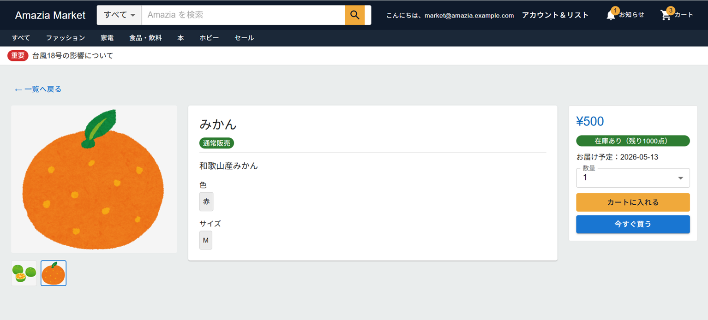
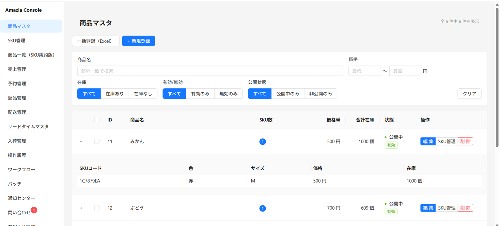
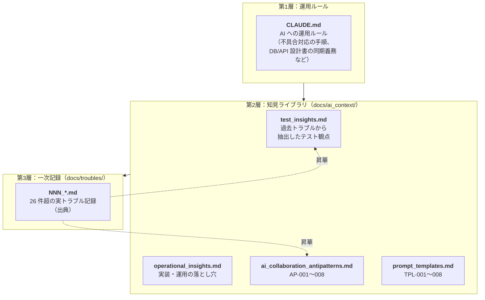

# Amazia — フルスタック実運用シミュレーション

> 個人開発で「業務レベルの EC 基盤」を設計・実装・デプロイ・運用まで一貫して作り切る挑戦をしています。
> 3 システム連携・自前 CI/CD・AWS 本番運用・AI 協働開発を統合しています。

<p align="center">
  
  
</p>

---

## Amazia 3 本柱

- **マルチシステム連携** — React（Market）+ Vue/PHP（Console）+ Java/Spring Boot（Core）+ MySQL の 3 アプリを 1 つの EC 基盤として連動
- **完全自動 CI/CD** — GitHub Actions → ECR → S3 → SSM → ヘルスチェックを自前構築。ゾンビコンテナ・SSM 不達など実運用の落とし穴を踏み抜きながら強化
- **AI 協働開発の制度化** — Claude Code を中核に、コンテキスト設計（CLAUDE.md → `docs/ai_context/` → `docs/troubles/`）でリポジトリ自体を「AI が学習し続ける資産」として運用

---

## 4 つの差別化要素

### 1. AI 協働開発の資産化

「ChatGPT で作りました」ではなく、**AI に渡すコンテキストそのものを設計・蓄積**しているのがこのプロジェクトの最大の特徴です。



- **トラブル記録 → 知見化 → AI 参照のループ**：[docs/troubles/](docs/troubles/) に蓄積された不具合は、CLAUDE.md のルールに従って各知見ファイルに昇華され、次のフェーズの計画段階で AI が自動的に参照する
- **AI 暴走を抑える設計**：DB/API を変更したフェーズ内で必ず設計書を更新する義務を CLAUDE.md に明文化し、コードと設計書の乖離をガードレールで防止
- **他 AI への移植性**：本構成は Claude Code 固有ではなく、Cursor / Copilot / Codex など任意の AI コーディング環境に同じ思想で適用可能

#### AI 協働コンテキスト ファイル一覧

| 層 | ファイル | 役割 |
|---|---|---|
| 第1層 | [CLAUDE.md](CLAUDE.md) | AI への運用ルール（不具合対応の手順、DB/API 設計書の同期義務、主要テーブル定数の同期 など） |
| 第2層 | [test_insights.md](docs/ai_context/test_insights.md) | 過去トラブルから抽出したテスト観点。テストケース作成・フェーズ計画時に参照 |
| 第2層 | [operational_insights.md](docs/ai_context/operational_insights.md) | Spring Boot ライフサイクル / コンテナ運用 / SSM 経由ジョブなど、テストでは検出しづらい設計パターン |
| 第2層 | [ai_collaboration_antipatterns.md](docs/ai_context/ai_collaboration_antipatterns.md) | AI 協働で踏みやすい落とし穴（**AP-001〜008**）。各 AP は出典トラブル番号と紐付け |
| 第2層 | [prompt_templates.md](docs/ai_context/prompt_templates.md) | 作業種別ごとの定型プロンプト（**TPL-001〜008**）。各 TPL は対応する AP-* と双方向リンク |
| 第3層 | [docs/troubles/](docs/troubles/) | 一次記録（NNN_*.md）。26 件超の実トラブルを「症状 / 根本原因 / 再発防止 / AI 協働観点」で記録 |

---

### 2. 実運用トラブル 26 件超の記録と「学び」

サーバーサイドエンジニアにとって、体系化された知識より「実際にハマって解決した経験」の方が現場で効く — その考えのもと、**トラブルは積極的に踏み抜き、原因・再発防止・AI 協働観点を全件記録**しています。

代表例：

| # | カテゴリ | 学び |
|---|---|---|
| 022 → 025 → 026 | SSM デプロイ系 | 「正常応答」と「正常動作」は別物。PingStatus を信じる検知から、実コマンド配信を直接観測する **カナリア方式** に到達した経緯 |
| 019 / 020 / 032 | 認証・セッション | Cookie ドメインの取り違え、JWT 署名アルゴリズム（HS256/HS512）の Console-Core 間不一致 など、認証境界をまたぐと表面化する不具合の典型例 |
| 044 / phaseX-6 | スキーマ整合 | `continue-on-error` で潰された DDL 失敗をデプロイ後 1 分以内に検知する仕組みを後付け実装 |

すべての記録：[docs/troubles/README.md](docs/troubles/README.md)

---

### 3. 業務レベルの 3 システム構成

| システム | 役割 | 言語・FW |
|---|---|---|
| **Amazia Market** | 会員向け EC フロント | React + MUI |
| **Amazia Console** | 商品・会員・注文の管理画面、ワークフロー（承認） | Vue（UI） + Laravel/PHP（API） + Ant Design Vue |
| **Amazia Core** | 在庫・物流・バッチ処理 | Java + Spring Boot |
| **DB** | データストア | MySQL |

「フロントは変更頻度が高いので React、管理画面はフォーム中心なので PHP、在庫・バッチは堅牢性重視で Java」というように、**領域特性に合わせた技術選定**を行っています（学習目的で意図的に多言語化している側面もあり）。


---

### 4. 自前 CI/CD パイプライン

GitHub Actions から ECR / S3 / SSM を組み合わせた**完全自動デプロイ**を構築しています。テスト → ビルド → コンテナ push → SSM 経由でのデプロイ・nginx reload まで、すべてコードで管理。


詳細図（Mermaid 版）：[docs/cicd_pipeline.svg](docs/cicd_pipeline.svg)

---

## クイックスタート

```bash
# 起動
docker compose -f docker-compose.local.yml up --build

# 停止
docker compose -f docker-compose.local.yml down
```

| サービス | URL |
|---|---|
| Amazia Market（React） | http://localhost:5173 |
| Amazia Console UI（Vue） | http://localhost:5174 |
| Amazia Console API（Laravel） | http://localhost:8000 |
| Amazia Core API（Spring Boot） | http://localhost:8080 |

詳細手順：[docs/setup.md](docs/setup.md)

---

## ドキュメント

| カテゴリ | リンク |
|---|---|
| セットアップ | [docs/setup.md](docs/setup.md) |
| コーディング規約 | [docs/coding_guidelines.md](docs/coding_guidelines.md) |
| アーキテクチャ図 | [docs/architecture.svg](docs/architecture.svg) |
| CI/CD パイプライン図 | [docs/cicd_pipeline.svg](docs/cicd_pipeline.svg) |
| API 定義（Console / Market / Core） | [docs/api_design/](docs/api_design/) |
| DB 設計（ER 図・テーブル定義） | [docs/database_design/README.md](docs/database_design/README.md) |
| 実装フェーズ別設計書 | [docs/design/](docs/design/) |
| トラブル記録 | [docs/troubles/README.md](docs/troubles/README.md) |
| 分析レポート | [docs/analysis/README.md](docs/analysis/README.md) |
| **AI 協働コンテキスト** | [CLAUDE.md](CLAUDE.md) / [docs/ai_context/](docs/ai_context/) |

---

## 実装フェーズ

- **Phase 1〜15**：✅ 完了（会員画面・管理画面・商品 CRUD・Excel 一括登録・商品マスタ・在庫/価格管理・認証・ワークフロー・購入・配送）
- **Phase 16**：🟡 着手中（UI デザイン改善）
- **Phase 17〜20**：🔲 未着手（バッチ処理・問い合わせ・お知らせ・**ドキュメント整理**）
- **Phase X-1〜X-7**：本番運用で発生した課題への対応フェーズ（HTTPS 化・メモリ最適化・デプロイ後ヘルスチェック・AI 協働アンチパターン整備など。X-2〜X-4, X-6, X-7 完了済み）

詳細な進捗表：[docs/design/](docs/design/)

---

## このプロジェクトの位置づけ

「設計書を書ける」ことと「設計書通りに動くシステムを最後まで作りきれる」ことの間にある距離を、自分の手で埋めることを目的としたプロジェクトです。

学習・検証・改善を繰り返しながら成長していくプロジェクトとして設計されており、新しい知見が得られるたびに設計・実装・ドキュメントへ反映していきます。
