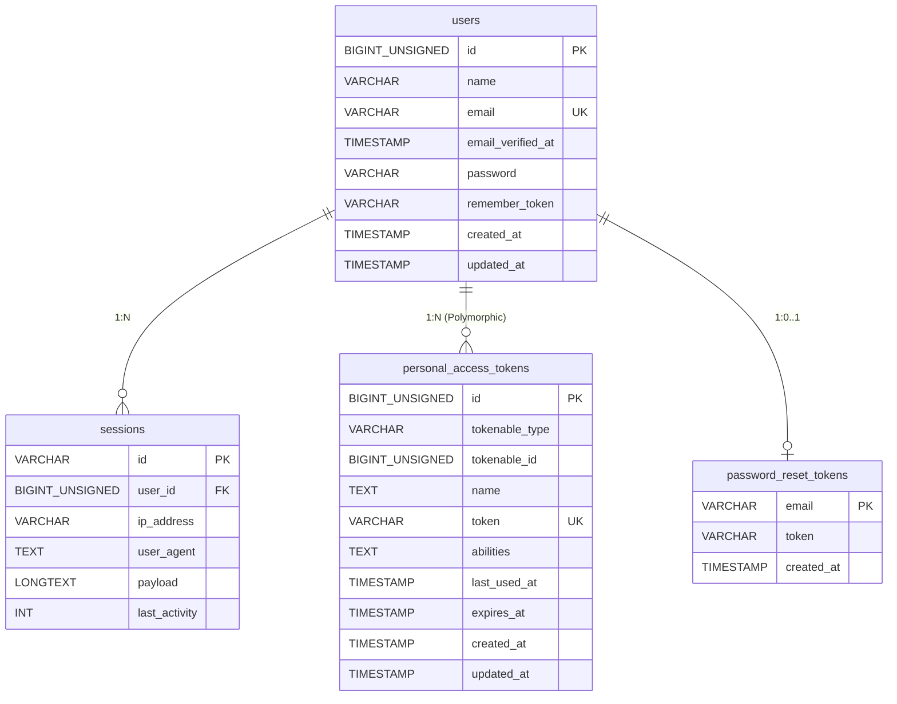

# ER図

## システム：Console



## システム：Core

```mermaid
erDiagram
    products {
        BIGINT id PK
        VARCHAR name
        TEXT description
        VARCHAR category
        DATE publish_start
        DATE publish_end
        VARCHAR status
        DATETIME created_at
        DATETIME updated_at
    }

    product_images {
        BIGINT id PK
        BIGINT product_id FK
        VARCHAR image_path
        INT sort_order
        DATETIME created_at
        DATETIME updated_at
    }

    product_skus {
        BIGINT id PK
        BIGINT product_id FK
        VARCHAR sku_code UK
        VARCHAR color
        VARCHAR size
        VARCHAR status
        DATETIME created_at
        DATETIME updated_at
    }

    product_sku_prices {
        BIGINT id PK
        BIGINT sku_id FK
        INT price
        DATE start_date
        DATE end_date
        DATETIME created_at
        DATETIME updated_at
    }

    product_sku_price_history {
        BIGINT id PK
        BIGINT sku_id FK
        INT price
        DATE start_date
        DATE end_date
        VARCHAR status
        DATETIME created_at
        DATETIME updated_at
    }

    product_sku_stocks {
        BIGINT id PK
        BIGINT sku_id FK_UK
        INT quantity
        DATETIME created_at
        DATETIME updated_at
    }

    product_sku_stock_transactions {
        BIGINT id PK
        BIGINT sku_id FK
        VARCHAR type
        INT quantity
        DATETIME created_at
    }

    product_sku_images {
        BIGINT id PK
        BIGINT sku_id FK
        VARCHAR image_path
        INT sort_order
        DATETIME created_at
        DATETIME updated_at
    }

    products ||--o{ product_images : "1:N"
    products ||--o{ product_skus : "1:N"
    product_skus ||--o{ product_sku_prices : "1:N"
    product_skus ||--o{ product_sku_price_history : "1:N"
    product_skus ||--o| product_sku_stocks : "1:0..1"
    product_skus ||--o{ product_sku_stock_transactions : "1:N"
    product_skus ||--o{ product_sku_images : "1:N"
```

## テーブル一覧

### Console システム

| テーブル名 | 論理名 | 用途 |
|------------|--------|------|
| users | ユーザー | Console管理者のアカウント情報 |
| password_reset_tokens | パスワードリセットトークン | パスワード再設定フロー |
| sessions | セッション | Webセッション管理 |
| personal_access_tokens | パーソナルアクセストークン | Sanctum APIトークン認証 |

### Core システム

| テーブル名 | 論理名 | 用途 |
|------------|--------|------|
| products | 商品 | 商品マスタ（価格・在庫を持たない） |
| product_images | 商品画像 | 商品単位の画像管理（sort_order=1がメイン） |
| product_skus | SKU | 色×サイズの組み合わせ単位の管理 |
| product_sku_prices | SKU現行価格 | SKUごとの現在有効な価格（1レコード） |
| product_sku_price_history | SKU価格履歴 | past / future / applied の価格履歴 |
| product_sku_stocks | SKU現在在庫 | SKUごとの現在在庫数（1レコード） |
| product_sku_stock_transactions | SKU在庫履歴 | 入荷・調整の変動履歴 |
| product_sku_images | SKU画像 | SKUごとの複数画像（sort_order=1がメイン） |

## 備考

- `product_skus` は (product_id, color, size) の複合UNIQUEを持つ
- `product_sku_stocks` は sku_id に UNIQUEを持つ（SKUにつき在庫レコードは1つ）
- `personal_access_tokens.tokenable` はPolymorphic関連のため、将来的に複数モデルに対応可能
