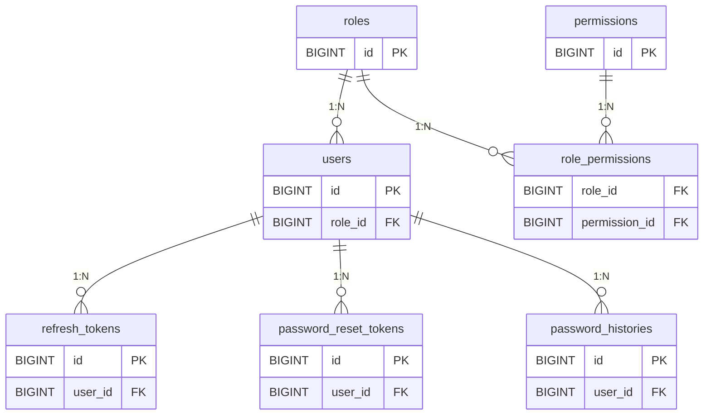
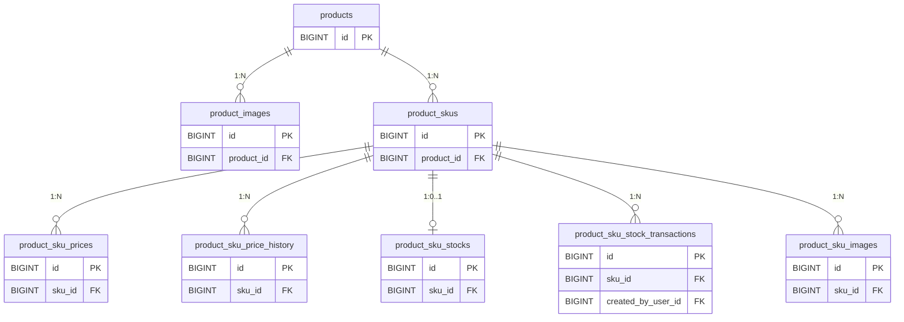
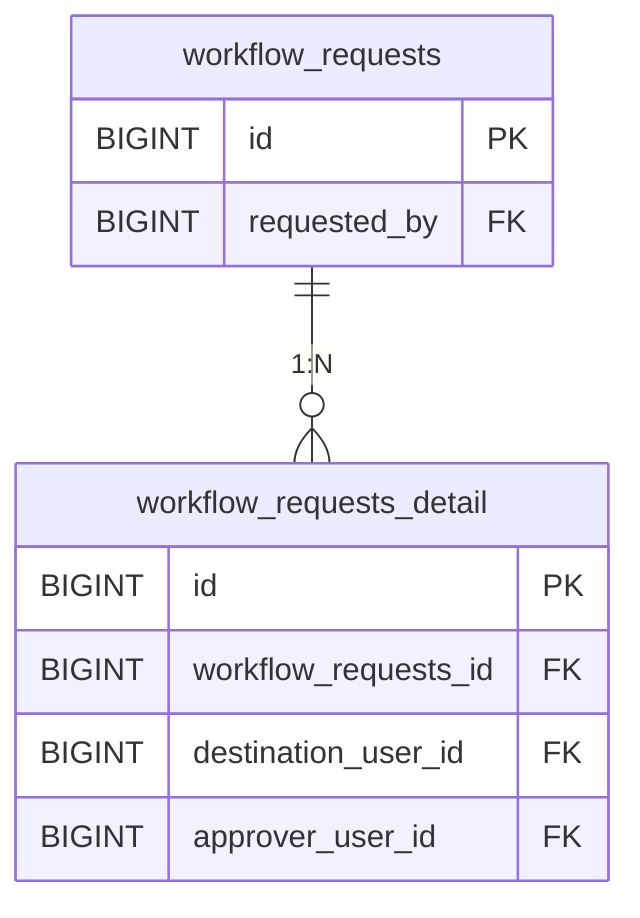
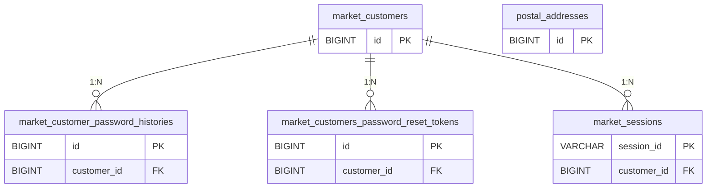
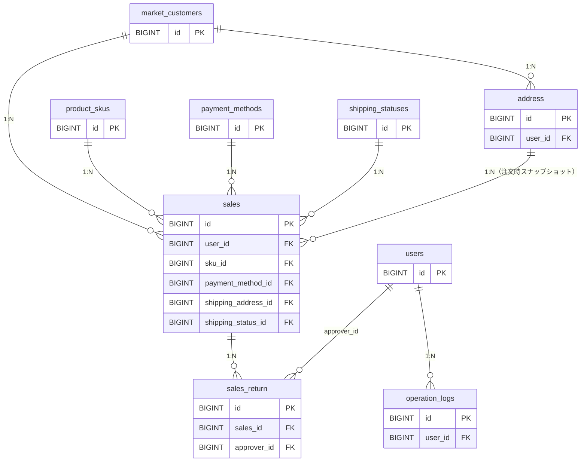
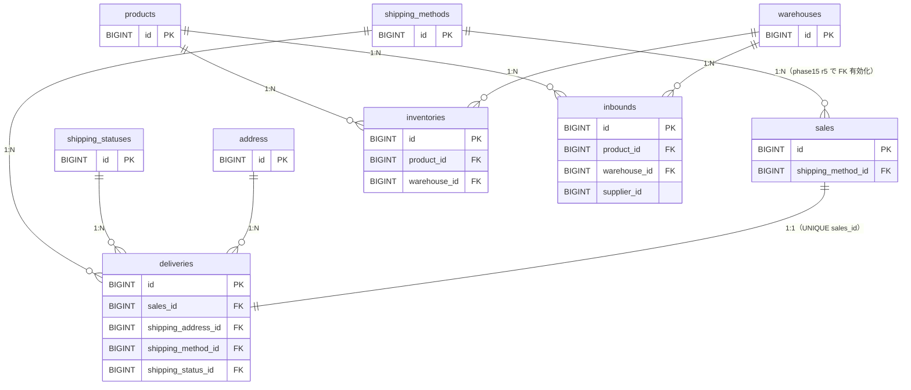
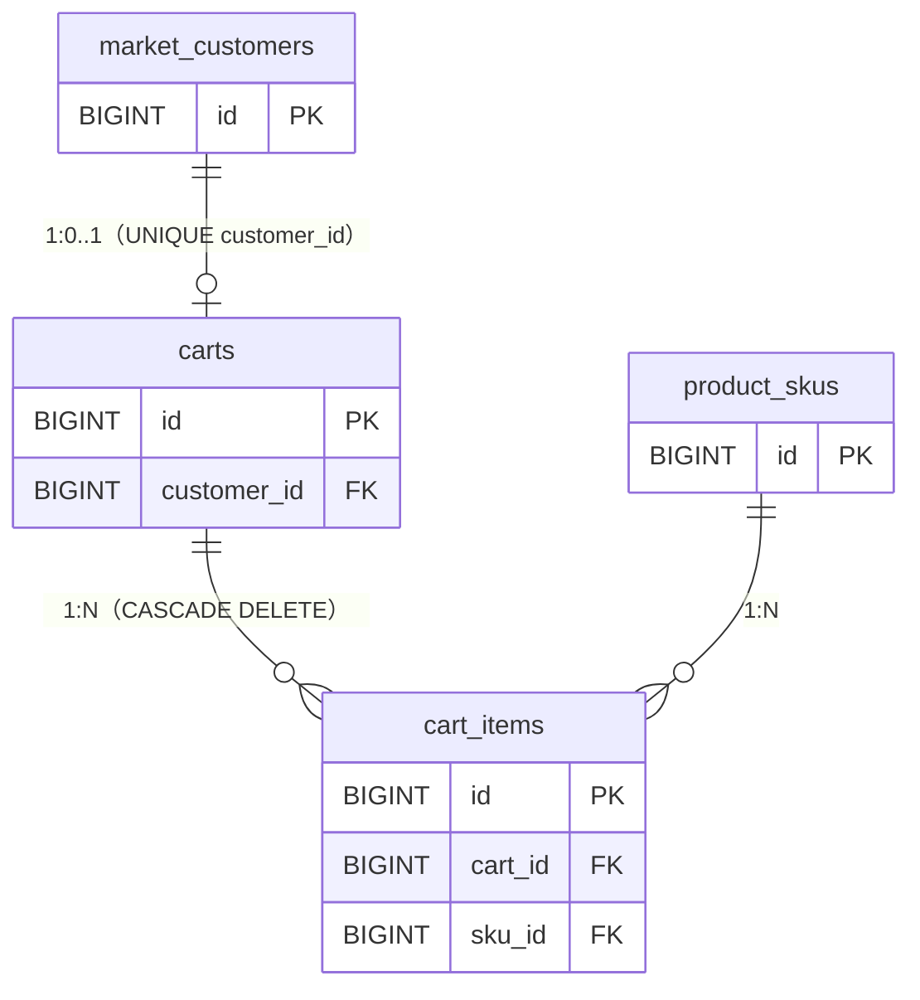
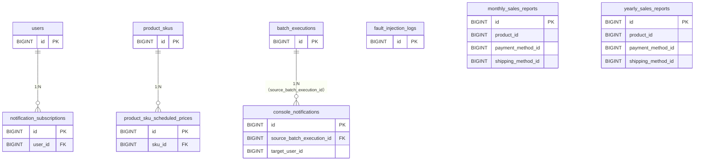

# ER図

ER図はシステム規模が大きくなったため、フェーズごとに分割して記載する。

> **方針**：ER図には **PK / FK のみ** を記載する（最も軽量）。
> - 関係性だけ見たいときに最適
> - 要件定義やレビューで使いやすい
> - 各カラムの型・制約・用途は `TBL_*.md` を参照（二重管理のリスクゼロ）

- [§1 Core 認証・認可（フェーズ11）](#1-core-認証認可フェーズ11)
- [§2 Core 商品管理（フェーズ8〜10）](#2-core-商品管理フェーズ810)
- [§3 Core ワークフロー（フェーズ12）](#3-core-ワークフローフェーズ12)
- [§4 Core Market 認証・会員（フェーズ13）](#4-core-market-認証会員フェーズ13)
- [§5 Core 購入・配送（フェーズ14）](#5-core-購入配送フェーズ14)
- [§6 Core 配送管理・在庫並行運用（フェーズ15）](#6-core-配送管理在庫並行運用フェーズ15)
- [§7 Core カート機能（フェーズ16.5）](#7-core-カート機能フェーズ165)
- [§8 Core バッチ処理基盤（フェーズ17）](#8-core-バッチ処理基盤フェーズ17)
- [テーブル一覧](#テーブル一覧)
- [備考](#備考)

---

## 1. Core 認証・認可（フェーズ11）

---

## 2. Core 商品管理（フェーズ8〜10）

---

## 3. Core ワークフロー（フェーズ12）

> `requested_by` / `destination_user_id` / `approver_user_id` はいずれも `users.id` を参照する想定（schema.sql 上は明示的な FK 制約は付与されていない）。

---

## 4. Core Market 認証・会員（フェーズ13）

> `postal_addresses` は郵便番号 → 住所自動入力用の参照マスタで、`market_customers` との FK はない。1 郵便番号に複数町域が紐づくため `postal_code` は UNIQUE ではない。

---

## 5. Core 購入・配送（フェーズ14）

> - `sales.user_id` は `market_customers.id` を参照（Console 社員 `users` ではない）。
> - `sales.shipping_method_id` の FK 制約はフェーズ15 r5 で `shipping_methods` 作成と同時に付与済み（§6 参照）。
> - `address` は注文時の住所スナップショット。`market_customers.postal_code/address` を直接参照せず、注文ごとに別レコードとして保持する。

---

## 6. Core 配送管理・在庫並行運用（フェーズ15）

> - `inventories` は **並行運用書き込み正本**：入荷・販売・返品復元の全経路から `InventorySyncService` 経由で同期更新される。読み取り正本は phase14 r2 まで `products.stock` のまま（RRRR-1 / RRRR-2）。
> - `warehouses` は並行運用期はダミー1行（id=1 'default'）のみ。`inventories.warehouse_id` / `inbounds.warehouse_id` の DEFAULT=1 で運用。
> - `deliveries.sales_id` は UNIQUE で 1:1 関係。分割配送・ギフト配送はスコープ外（RR-3）。
> - `inquiries.target_type='delivery' / target_id=deliveries.id` 方式で問い合わせと紐付ける（phase18 と整合）ため、`deliveries.inquiry_id` は持たない（R-2）。

---

## 7. Core カート機能（フェーズ16.5）

> - `carts.customer_id` は UNIQUE で1顧客1カート。Checkout 完了時に `cart_items` を全削除（カート行は残す）。
> - `cart_items` は `(cart_id, sku_id, is_preorder)` の複合 UNIQUE で、同一 SKU・同一フラグは1行に集約され `quantity` で数量加算する。
> - `cart_items.is_preorder` は通常購入と予約購入を区別する。Checkout 時は通常購入分のみ在庫減算する（既存 sales フローと同じ判定）。

---

## 8. Core バッチ処理基盤（フェーズ17）

> - `console_notifications.target_user_id` / `monthly_sales_reports.product_id` / 等は schema.sql 上は明示的な FK 制約を持たない（NULL 運用・集計軸の柔軟性のため）。
> - `fault_injection_logs.environment` は `CHECK (environment IN ('dev', 'staging'))` で本番からの INSERT を物理拒否する（五重防御の DB 層）。
> - `notification_subscriptions` は `(user_id, subscription_tag)` の UNIQUE で 1 ユーザー × 1 タグが一意。
> - `product_sku_scheduled_prices` の「未適用は 1 SKU 1 件まで」はアプリ側 UPSERT で担保（部分 UNIQUE が MySQL でサポートされないため）。

---

## テーブル一覧

### Core システム（認証・認可）— フェーズ11

| テーブル名 | 論理名 | 用途 | 追加フェーズ |
|------------|--------|------|------------|
| roles | ロール | admin / user のロール定義 | フェーズ11 |
| permissions | パーミッション | 画面単位のアクセス権限定義 | フェーズ11 |
| role_permissions | ロール・パーミッション中間 | ロールと権限の多対多関係 | フェーズ11 |
| users | ユーザー | Console社員アカウント（JWT認証・ロール・ロックアウト対応） | フェーズ11で刷新 |
| refresh_tokens | リフレッシュトークン | JWT認証のリフレッシュトークン管理 | フェーズ11 |
| password_reset_tokens | パスワードリセットトークン | パスワード再発行フロー用一時トークン | フェーズ11で刷新 |
| password_histories | パスワード履歴 | Console社員パスワード再利用防止用履歴 | フェーズ11 |

### Core システム（商品管理）— フェーズ8〜10

| テーブル名 | 論理名 | 用途 | 追加フェーズ |
|------------|--------|------|------------|
| products | 商品 | 商品マスタ（価格・在庫を持たない） | フェーズ8 |
| product_images | 商品画像 | 商品単位の画像管理（sort_order=1がメイン） | フェーズ9 |
| product_skus | SKU | 色×サイズの組み合わせ単位の管理 | フェーズ10 |
| product_sku_prices | SKU現行価格 | SKUごとの現在有効な価格（1レコード） | フェーズ10 |
| product_sku_price_history | SKU価格履歴 | past / future / applied の価格履歴 | フェーズ10 |
| product_sku_stocks | SKU現在在庫 | SKUごとの現在在庫数（1レコード） | フェーズ10 |
| product_sku_stock_transactions | SKU在庫履歴 | 入荷・調整の変動履歴（P11で reference_*, created_by_user_id, comment 追加） | フェーズ10 |
| product_sku_images | SKU画像 | SKUごとの複数画像（sort_order=1がメイン） | フェーズ10 |

### Core システム（ワークフロー）— フェーズ12

| テーブル名 | 論理名 | 用途 | 追加フェーズ |
|------------|--------|------|------------|
| workflow_requests | ワークフロー申請 | 申請メタ情報（target_type / status / payload JSON） | フェーズ12 |
| workflow_requests_detail | ワークフロー申請詳細 | 段階別承認情報（destination / approver） | フェーズ12 |

### Core システム（Market 認証・会員）— フェーズ13

| テーブル名 | 論理名 | 用途 | 追加フェーズ |
|------------|--------|------|------------|
| market_customers | Market 顧客マスタ | Market 会員アカウント（Console `users` とは別系統） | フェーズ13 |
| market_customer_password_histories | Market 顧客パスワード履歴 | パスワード再利用検証用 | フェーズ13 |
| market_customers_password_reset_tokens | Market 顧客パスワードリセットトークン | Market 側パスワード再発行フロー | フェーズ13 |
| market_sessions | Market セッション | Cookieベースセッション（CSRFトークン含む） | フェーズ13 |
| postal_addresses | 郵便番号→住所マスタ | KEN_ALL 取込先（住所自動入力用） | フェーズ13 |

### Core システム（購入・配送）— フェーズ14

| テーブル名 | 論理名 | 用途 | 追加フェーズ |
|------------|--------|------|------------|
| sales | 売上・注文 | Market 顧客の購入レコード | フェーズ14 |
| sales_return | 返品管理 | 返品申請〜承認〜通知の状態管理 | フェーズ14 |
| address | 配送先住所スナップショット | 注文時点の住所を非正規化保持 | フェーズ14 |
| payment_methods | 決済方法マスタ | credit_card / d_payment / cash_on_delivery 初期投入 | フェーズ14 |
| shipping_statuses | 配送ステータスマスタ | PENDING〜RESCHEDULED の8ステータス | フェーズ14 |
| operation_logs | 操作履歴 | Console 画面・API の操作記録（screen_name / api_name 追加） | フェーズ14 |

### Core システム（配送管理・在庫並行運用）— フェーズ15

| テーブル名 | 論理名 | 用途 | 追加フェーズ |
|------------|--------|------|------------|
| shipping_methods | 配送方法マスタ | home_delivery / konbini_pickup / dropoff の3件投入 | フェーズ15 |
| warehouses | 倉庫マスタ | 並行運用期はダミー1行（id=1 'default'）のみ | フェーズ15 |
| inventories | 商品×倉庫の現在在庫 | 並行運用書き込み正本（販売・入荷・返品復元から同期更新） | フェーズ15 |
| inbounds | 商品入荷ヘッダ | 入荷数量・倉庫・入荷日のヘッダ管理 | フェーズ15 |
| deliveries | 配送実体 | 注文確定と同時に sales 1:1 で生成。配送ステータス遷移・追跡番号管理 | フェーズ15 |

### Core システム（カート機能）— フェーズ16.5

| テーブル名 | 論理名 | 用途 | 追加フェーズ |
|------------|--------|------|------------|
| carts | カート | 1顧客1カート（UNIQUE customer_id）| フェーズ16.5 |
| cart_items | カート明細 | 同一 SKU・同一 is_preorder は1行に集約（複合 UNIQUE）| フェーズ16.5 |

### Core システム（バッチ処理基盤）— フェーズ17

| テーブル名 | 論理名 | 用途 | 追加フェーズ |
|------------|--------|------|------------|
| batch_executions | バッチ実行履歴 | バッチ起動／成功／失敗の正本 | フェーズ17 |
| console_notifications | Console 通知センター | タグ別／ユーザー別通知の正本 | フェーズ17 |
| notification_subscriptions | 通知購読設定 | ユーザー × タグ単位の購読フラグ | フェーズ17 |
| fault_injection_logs | フォルトインジェクション実行履歴 | dev / staging 限定の障害注入ログ（CHECK で本番拒否） | フェーズ17 |
| monthly_sales_reports | 月次売上レポート | 月次バッチが UPSERT する正本（4軸 NULL 運用） | フェーズ17 |
| yearly_sales_reports | 年次売上レポート | 年次バッチが UPSERT する正本（4軸 NULL 運用） | フェーズ17 |
| product_sku_scheduled_prices | SKU 価格変更予約 | apply_date 到来時に ApplyScheduledPricesJob が反映 | フェーズ17 |

> 既存テーブル `product_sku_prices` にはフェーズ17 で `is_active`（BOOLEAN NOT NULL DEFAULT TRUE）を追加済み。

---

## 備考

### カラム詳細の参照先
ER図は **PK / FK のみ** を表示する設計に統一した。各テーブルの全カラム・型・制約・インデックスは個別の `TBL_<テーブル名>.md` を参照すること（同じ情報を ER 図と TBL 定義書の両方に書くと、片方だけ更新されて乖離する事故が起きるため）。

### 共通ルール
- 物理型は `users` / `market_customers` / `address` など Laravel 由来 ID 系が `BIGINT_UNSIGNED`、Core オリジナルテーブルは `BIGINT`。FK では型を合わせる必要がある（029 / 037 起因）。ER 図上は簡略化のため `BIGINT` 表記で統一している。
- `refresh_tokens` / `password_reset_tokens` / `market_customers_password_reset_tokens` はトークン実体ではなくハッシュ値のみ格納する。

### 商品管理（§2）
- `product_skus` は (product_id, color, size) の複合UNIQUEを持つ
- `product_sku_stocks` は sku_id に UNIQUEを持つ（SKUにつき在庫レコードは1つ）
- 楽観ロック用 `version` カラムは P12 で `products` / `product_sku_prices` / `product_sku_stocks` に追加

### 認証（§1）
- `users` テーブルはフェーズ11でLaravel Sanctum管理からJWT認証管理に全面刷新

### Market（§4）
- Console の `users`（社員）と Market の `market_customers`（顧客）は別系統で同居する。Market 側 API は `market_customers.id` を主体として動作する。

### 購入・配送（§5）
- `sales.user_id` は `market_customers.id` を参照する（Console 社員 `users` ではない）。
- `address` は注文時のスナップショット。`market_customers` のプロフィール住所と独立に保持される（住所変更しても過去注文の配送先は不変）。

### 配送管理・在庫並行運用（§6）
- `inventories` は **並行運用書き込み正本**。phase14 r2 で完全移行されるまで読み取り正本は `products.stock` のまま。両系統で同期更新することで `products.stock(product_id) == SUM(inventories.quantity by product_id)` の不変条件を維持する。
- `warehouses` は phase15 r5 ではダミー1行のみ。Console 入荷登録 UI では倉庫選択フィールドを表示せず、バックエンドが DEFAULT=1 を自動セット（RRRR-5）。
- `deliveries` は注文確定と同時に生成（`sales : deliveries = 1 : 1`）。発送前キャンセル / 配達失敗 / 再配達 / 分割配送 / ギフト配送はスコープ外（phase14 r2 でのマスタ拡張前提）。

### マイグレーション方式
- 本番 Core は Flyway 未使用。`amazia-core/src/main/resources/schema.sql` を `spring.sql.init.mode=always` で起動時実行する。
- `db/migration/V1〜V5.sql` は名残ファイルで本番では実行されない。新規スキーマ変更は schema.sql に IF NOT EXISTS / continue-on-error で追記する（037 起因 — `docs/ai_context/operational_insights.md` カテゴリ3 参照）。
