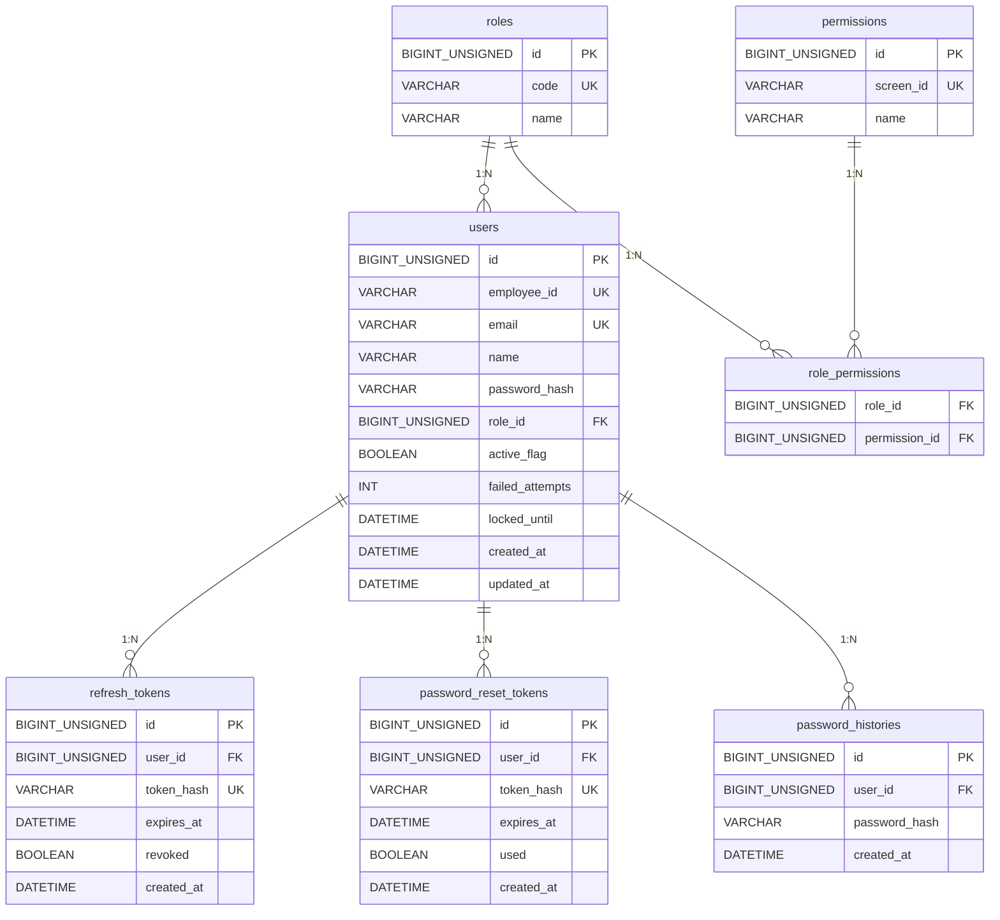
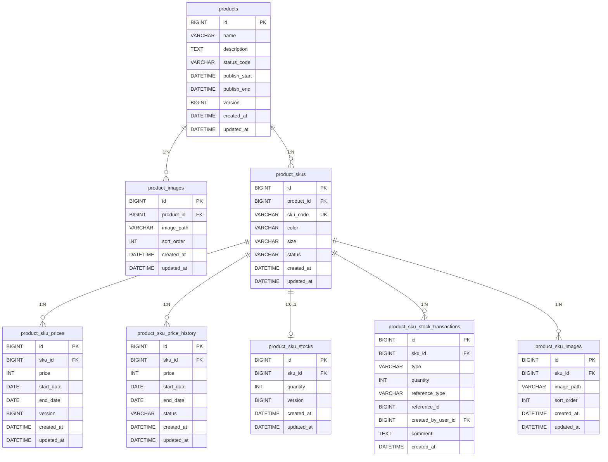
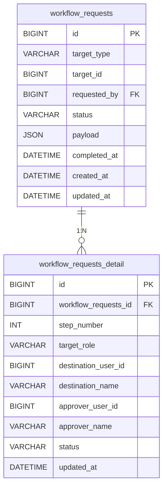
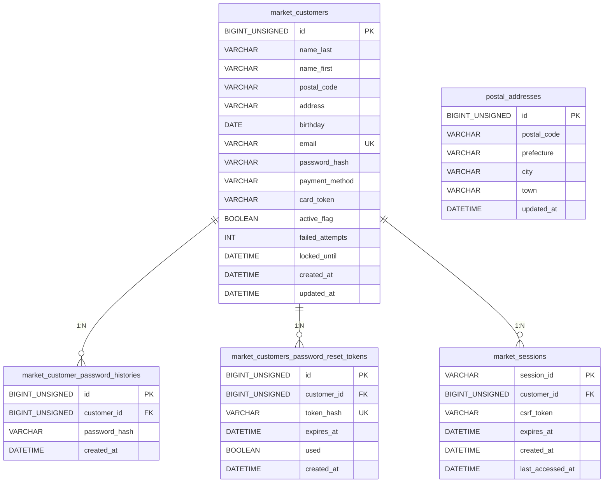
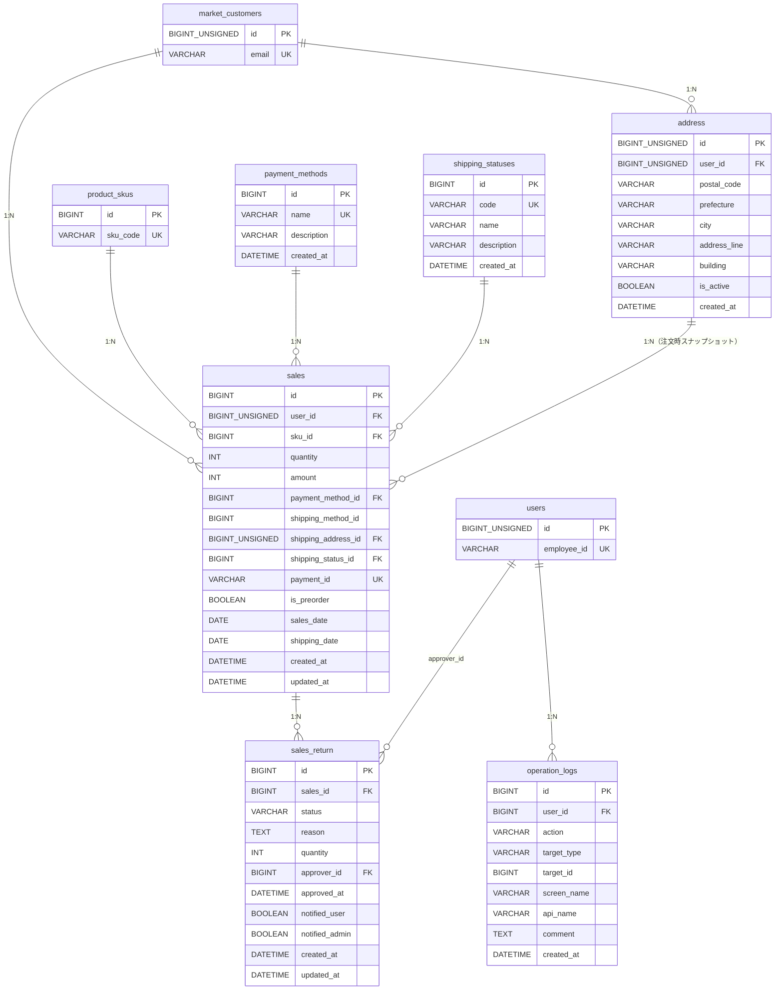

# ER図

ER図はシステム規模が大きくなったため、フェーズごとに分割して記載する。

- [§1 Core 認証・認可（フェーズ11）](#1-core-認証認可フェーズ11)
- [§2 Core 商品管理（フェーズ8〜10）](#2-core-商品管理フェーズ810)
- [§3 Core ワークフロー（フェーズ12）](#3-core-ワークフローフェーズ12)
- [§4 Core Market 認証・会員（フェーズ13）](#4-core-market-認証会員フェーズ13)
- [§5 Core 購入・配送（フェーズ14）](#5-core-購入配送フェーズ14)
- [テーブル一覧](#テーブル一覧)
- [備考](#備考)

---

## 1. Core 認証・認可（フェーズ11）

---

## 2. Core 商品管理（フェーズ8〜10）

---

## 3. Core ワークフロー（フェーズ12）

> `requested_by` / `destination_user_id` / `approver_user_id` はいずれも `users.id` を参照する想定（schema.sql 上は明示的な FK 制約は付与されていない）。

---

## 4. Core Market 認証・会員（フェーズ13）

> `postal_addresses` は郵便番号 → 住所自動入力用の参照マスタで、`market_customers` との FK はない。1 郵便番号に複数町域が紐づくため `postal_code` は UNIQUE ではない。

---

## 5. Core 購入・配送（フェーズ14）

> - `sales.user_id` は `market_customers.id` を参照（Console 社員 `users` ではない）。
> - `sales.shipping_method_id` の FK 制約はフェーズ15 で `shipping_methods` テーブル作成後に付与予定（schema.sql コメント参照）。
> - `address` は注文時の住所スナップショット。`market_customers.postal_code/address` を直接参照せず、注文ごとに別レコードとして保持する。

---

## テーブル一覧

### Core システム（認証・認可）— フェーズ11

| テーブル名 | 論理名 | 用途 | 追加フェーズ |
|------------|--------|------|------------|
| roles | ロール | admin / user のロール定義 | フェーズ11 |
| permissions | パーミッション | 画面単位のアクセス権限定義 | フェーズ11 |
| role_permissions | ロール・パーミッション中間 | ロールと権限の多対多関係 | フェーズ11 |
| users | ユーザー | Console社員アカウント（JWT認証・ロール・ロックアウト対応） | フェーズ11で刷新 |
| refresh_tokens | リフレッシュトークン | JWT認証のリフレッシュトークン管理 | フェーズ11 |
| password_reset_tokens | パスワードリセットトークン | パスワード再発行フロー用一時トークン | フェーズ11で刷新 |
| password_histories | パスワード履歴 | Console社員パスワード再利用防止用履歴 | フェーズ11 |

### Core システム（商品管理）— フェーズ8〜10

| テーブル名 | 論理名 | 用途 | 追加フェーズ |
|------------|--------|------|------------|
| products | 商品 | 商品マスタ（価格・在庫を持たない） | フェーズ8 |
| product_images | 商品画像 | 商品単位の画像管理（sort_order=1がメイン） | フェーズ9 |
| product_skus | SKU | 色×サイズの組み合わせ単位の管理 | フェーズ10 |
| product_sku_prices | SKU現行価格 | SKUごとの現在有効な価格（1レコード） | フェーズ10 |
| product_sku_price_history | SKU価格履歴 | past / future / applied の価格履歴 | フェーズ10 |
| product_sku_stocks | SKU現在在庫 | SKUごとの現在在庫数（1レコード） | フェーズ10 |
| product_sku_stock_transactions | SKU在庫履歴 | 入荷・調整の変動履歴（P11で reference_*, created_by_user_id, comment 追加） | フェーズ10 |
| product_sku_images | SKU画像 | SKUごとの複数画像（sort_order=1がメイン） | フェーズ10 |

### Core システム（ワークフロー）— フェーズ12

| テーブル名 | 論理名 | 用途 | 追加フェーズ |
|------------|--------|------|------------|
| workflow_requests | ワークフロー申請 | 申請メタ情報（target_type / status / payload JSON） | フェーズ12 |
| workflow_requests_detail | ワークフロー申請詳細 | 段階別承認情報（destination / approver） | フェーズ12 |

### Core システム（Market 認証・会員）— フェーズ13

| テーブル名 | 論理名 | 用途 | 追加フェーズ |
|------------|--------|------|------------|
| market_customers | Market 顧客マスタ | Market 会員アカウント（Console `users` とは別系統） | フェーズ13 |
| market_customer_password_histories | Market 顧客パスワード履歴 | パスワード再利用検証用 | フェーズ13 |
| market_customers_password_reset_tokens | Market 顧客パスワードリセットトークン | Market 側パスワード再発行フロー | フェーズ13 |
| market_sessions | Market セッション | Cookieベースセッション（CSRFトークン含む） | フェーズ13 |
| postal_addresses | 郵便番号→住所マスタ | KEN_ALL 取込先（住所自動入力用） | フェーズ13 |

### Core システム（購入・配送）— フェーズ14

| テーブル名 | 論理名 | 用途 | 追加フェーズ |
|------------|--------|------|------------|
| sales | 売上・注文 | Market 顧客の購入レコード | フェーズ14 |
| sales_return | 返品管理 | 返品申請〜承認〜通知の状態管理 | フェーズ14 |
| address | 配送先住所スナップショット | 注文時点の住所を非正規化保持 | フェーズ14 |
| payment_methods | 決済方法マスタ | credit_card / d_payment / cash_on_delivery 初期投入 | フェーズ14 |
| shipping_statuses | 配送ステータスマスタ | PENDING〜RESCHEDULED の8ステータス | フェーズ14 |
| operation_logs | 操作履歴 | Console 画面・API の操作記録（screen_name / api_name 追加） | フェーズ14 |

---

## 備考

### 共通ルール
- BIGINT_UNSIGNED は users / market_customers / address など Laravel 由来 ID 系。Core オリジナルテーブルは BIGINT のため、FK では型を合わせる必要がある（029 / 037 起因）。
- `refresh_tokens` / `password_reset_tokens` / `market_customers_password_reset_tokens` はトークン実体ではなくハッシュ値のみ格納する。

### 商品管理（§2）
- `product_skus` は (product_id, color, size) の複合UNIQUEを持つ
- `product_sku_stocks` は sku_id に UNIQUEを持つ（SKUにつき在庫レコードは1つ）
- 楽観ロック用 `version` カラムは P12 で `products` / `product_sku_prices` / `product_sku_stocks` に追加

### 認証（§1）
- `users` テーブルはフェーズ11でLaravel Sanctum管理からJWT認証管理に全面刷新

### Market（§4）
- Console の `users`（社員）と Market の `market_customers`（顧客）は別系統で同居する。Market 側 API は `market_customers.id` を主体として動作する。

### 購入・配送（§5）
- `sales.user_id` は `market_customers.id` を参照する（Console 社員 `users` ではない）。
- `address` は注文時のスナップショット。`market_customers` のプロフィール住所と独立に保持される（住所変更しても過去注文の配送先は不変）。

### マイグレーション方式
- 本番 Core は Flyway 未使用。`amazia-core/src/main/resources/schema.sql` を `spring.sql.init.mode=always` で起動時実行する。
- `db/migration/V1〜V5.sql` は名残ファイルで本番では実行されない。新規スキーマ変更は schema.sql に IF NOT EXISTS / continue-on-error で追記する（037 起因 — `docs/ai_context/operational_insights.md` カテゴリ3 参照）。
