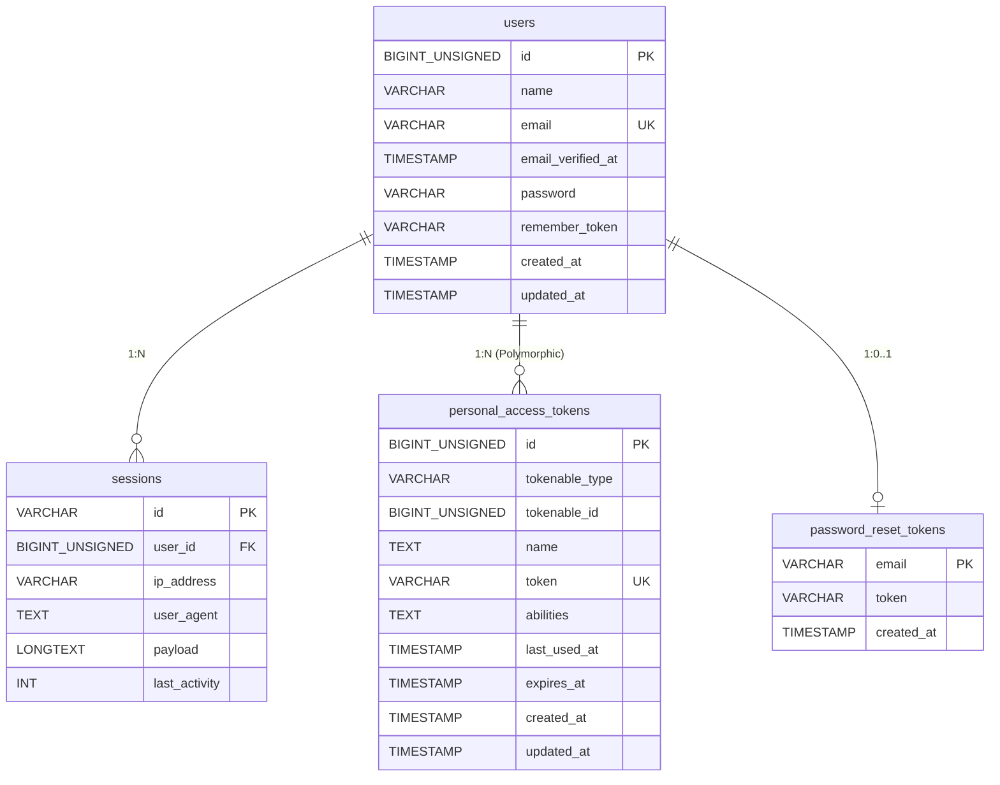

# ER図

## システム：Console

## テーブル一覧

| テーブル名 | 論理名 | 用途 |
|------------|--------|------|
| users | ユーザー | Console管理者のアカウント情報 |
| password_reset_tokens | パスワードリセットトークン | パスワード再設定フロー |
| sessions | セッション | Webセッション管理 |
| personal_access_tokens | パーソナルアクセストークン | Sanctum APIトークン認証 |

## 備考

- 現フェーズ（フェーズ11〜13）で認証機能を実装予定。商品・在庫・受注等のドメインテーブルは各フェーズで追加される。
- `personal_access_tokens.tokenable` はPolymorphic関連のため、将来的に複数モデル（Consoleユーザー・Marketユーザー等）に対応可能。
